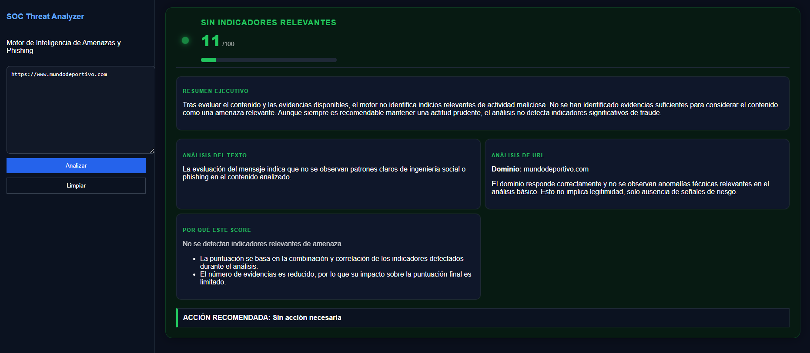
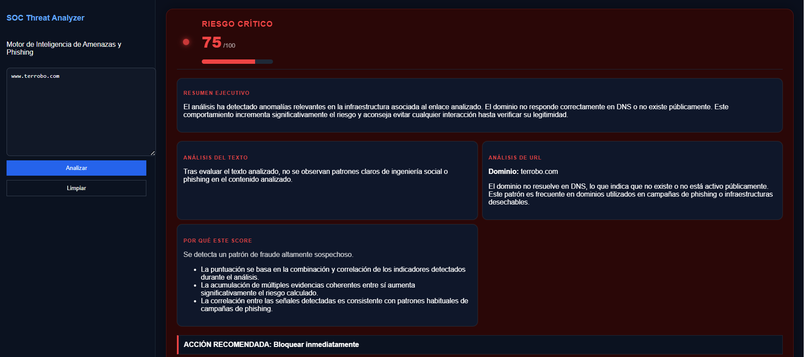
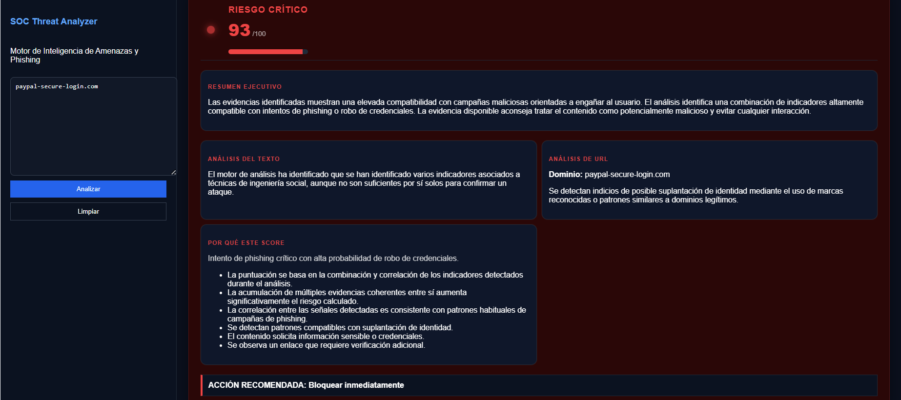
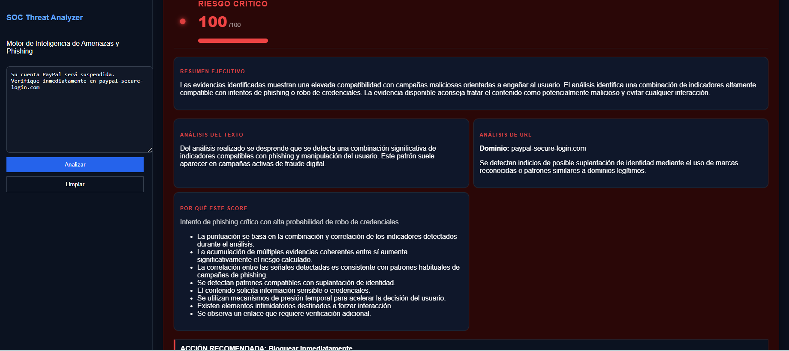

# Anti-Scam Detector

## Plataforma de Inteligencia de Seguridad para Detección de Phishing

Motor de análisis híbrido desarrollado para detectar campañas de phishing mediante la correlación de señales semánticas, análisis de infraestructura y reglas de comportamiento inspiradas en procesos SOC.

El objetivo no es únicamente clasificar amenazas, sino proporcionar evidencia y razonamiento que permitan justificar cada decisión de seguridad.

---

# Capturas de funcionamiento

## Contenido legítimo



## Riesgo por infraestructura de dominio



## Detección de suplantación de identidad



## Escenario completo de phishing



---

# El problema

Los ataques de phishing modernos rara vez dependen de un único indicador.

Las campañas actuales combinan:

* Suplantación de identidad.
* Robo de credenciales.
* Ingeniería social.
* Mensajes de urgencia.
* Dominios sospechosos.
* Infraestructura desechable.

Muchas soluciones generan una puntuación de riesgo, pero no explican claramente por qué una amenaza ha sido clasificada como peligrosa.

---

# La solución

Anti-Scam Detector analiza texto y URLs mediante múltiples capas independientes y correlaciona todas las evidencias para producir una evaluación de riesgo explicable.

El resultado final incluye:

* Puntuación de riesgo.
* Clasificación de amenaza.
* Evidencias detectadas.
* Explicación comprensible.
* Acción recomendada.

---

# Arquitectura de análisis

```text
Usuario
    │
    ▼
 FastAPI API
    │
    ├── Semantic Engine
    │      └── Sentence Transformers
    │
    ├── Infrastructure Engine
    │      ├── DNS Analysis
    │      └── WHOIS Analysis
    │
    ├── SOC Correlation Engine
    │
    ├── Risk Scoring Engine
    │
    └── Explainability Engine
             │
             ▼
      Evaluación Final
```

---

# Arquitectura del proyecto

```text
backend/
│
├── engines/
│   ├── semantic_engine.py
│   ├── infrastructure_engine.py
│   ├── explainability_engine.py
│   ├── scoring_utils.py
│   └── url_utils.py
│
├── analysis_engine.py
├── reasoning_engine.py
├── llm_engine.py
├── context_builder.py
└── server.py
```

---

# Tecnologías utilizadas

## Backend

* Python 3.11
* FastAPI
* Uvicorn
* NumPy
* Python-WHOIS

## Inteligencia Artificial y NLP

* Sentence Transformers
* paraphrase-multilingual-MiniLM-L12-v2
* Semantic Similarity
* Embedding-Based Classification

## Seguridad

* DNS Resolution
* WHOIS Analysis
* Brand Impersonation Detection
* Infrastructure Validation
* SOC Correlation Rules

## Frontend

* React
* JavaScript
* CSS

## Despliegue

* GitHub
* Render

---

# Pipeline de detección

## 1. Semantic Detection Layer

Detecta patrones relacionados con:

* Robo de credenciales.
* Suplantación de identidad.
* Ingeniería social.
* Urgencia.
* Amenazas.
* Enlaces sospechosos.

## 2. Infrastructure Analysis Layer

Analiza:

* Resolución DNS.
* Información WHOIS.
* Características estructurales del dominio.
* Indicadores de confianza.

## 3. SOC Correlation Layer

Correlaciona señales de identidad, comportamiento e infraestructura utilizando reglas inspiradas en centros de operaciones de seguridad (SOC).

## 4. Risk Scoring Engine

Normaliza todas las evidencias y genera una puntuación final entre 0 y 100.

## 5. Explainability Layer

Genera:

* Resumen ejecutivo.
* Justificación del riesgo.
* Evidencias detectadas.
* Acción recomendada.

---

# Casos de ejemplo

## Sitio legítimo

```text
https://www.mundodeportivo.com

Score: 13/100
Clasificación: Sin indicadores relevantes
Acción: Sin acción necesaria
```

## Dominio inexistente

```text
www.terrobo.com

Score: 75/100
Clasificación: Riesgo crítico
Acción: Bloquear inmediatamente
```

## Suplantación de identidad

```text
paypal-secure-login.com

Score: 93/100
Clasificación: Riesgo crítico
Acción: Bloquear inmediatamente
```

## Intento completo de phishing

```text
Su cuenta PayPal será suspendida.
Verifique inmediatamente en paypal-secure-login.com

Score: 93+/100
Clasificación: Riesgo crítico
Acción: Bloquear inmediatamente
```

---

# API

## POST /api/analyze

### Solicitud

```json
{
  "text": "Verifique inmediatamente su cuenta",
  "input_type": "text"
}
```

### Respuesta

```json
{
  "verdict": {},
  "executive_summary": "",
  "analysis": {},
  "reasoning": {},
  "signals": []
}
```

---

# Instalación local

## Backend

```bash
pip install -r requirements.txt
uvicorn backend.server:app --reload --port 8000
```

## Frontend

```bash
cd frontend
npm install
npm start
```

---
## Deployment Modes

Anti-Scam Detector soporta dos modos de ejecución distintos según el entorno donde se despliega.

### Public Demo Mode (Render Free)

La versión pública desplegada utiliza un motor optimizado para entornos con recursos limitados.

Características:

* Correlación de señales SOC.
* Detección de suplantación de identidad.
* Análisis DNS.
* Análisis WHOIS.
* Risk Scoring Engine.
* Explainability Engine.
* Recomendación de acción.

Configuración:

```env
USE_ML=false
```

Este modo se utiliza exclusivamente para garantizar estabilidad y disponibilidad en infraestructuras gratuitas con limitaciones de memoria.

---

### Full NLP Mode (Local Development)

La versión completa incorpora análisis semántico mediante Sentence Transformers.

Características adicionales:

* Semantic Similarity.
* Intent Detection.
* Embedding-Based Classification.
* NLP Correlation Layer.

Configuración:

```env
USE_ML=true
```

Modelo utilizado:

```text
sentence-transformers/paraphrase-multilingual-MiniLM-L12-v2
```

---

### Engineering Decision

La separación entre ambos modos responde exclusivamente a restricciones de infraestructura del entorno gratuito de despliegue.

La arquitectura ha sido diseñada mediante Feature Flags para permitir activar o desactivar la capa NLP sin modificar el resto del motor de análisis.

De esta forma el sistema mantiene:

* La misma arquitectura.
* El mismo motor de correlación.
* El mismo sistema de scoring.
* El mismo motor explicable.

Garantizando una experiencia estable tanto en entornos de demostración como en despliegues completos.

# Roadmap

* Integración de fuentes de inteligencia de amenazas.
* Análisis de reputación de dominios.
* Análisis ASN e infraestructura.
* Dashboard para analistas.
* Métricas de precisión y rendimiento.
* Visualización de tendencias de amenazas.

---

# Aviso

Esta herramienta tiene fines educativos, de investigación y defensa.

Su objetivo es ayudar en la evaluación del riesgo y la detección de phishing, pero no sustituye controles profesionales de seguridad ni procesos de validación adicionales.

---

# Autor

**Miguel Ángel Cuesta**

Máster en Ciberseguridad

GitHub: https://github.com/miguelangelcuesta
